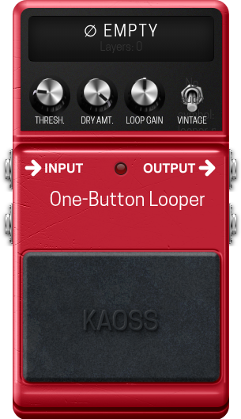

# One-Button Looper — LV2 Stereo Looper

**A simple stereo looper designed for single-button operation as an LV2 plugin, optimized for the MOD Audio platform.**

Forked from the original [Loopor](https://github.com/stevie67/loopor), this plugin has been modified for simpler operation, inspired by the simple single-button operation of loopers such as the TC Electronic Ditto and the Boss RC-1. It provides a single-footswitch workflow with stereo I/O and configurable controls for threshold, dry mix, overdubs and loop gain. It also features a big display showing the looper's internal state for easy operation.

<p align="center">
  
</p>

---

## Features
- **Stereo inputs and outputs** (In1/2 → Out1/2).
- **Single-button Ditto-style operation**: record, overdub, stop, undo/redo, clear.
- **Large colour display** showing the internal state of the looper and the number of layers for simplified operation.
- **Configurable input threshold** to auto-start recording on signal presence.
- **Dry amount control** to blend live input with looped audio.
- **High overdub capacity** and seamless loop end (no clicks).
- **Loop gain control** to control the volume level of the looped audio.

---

## Controls & Usage
- **Threshold** — Start recording only once signal exceeds this level. When set to the lowest level, recording starts immediately. 
- **Main Button** —
  * Press Once: Starts recording the loop.
  * Press Again: Ends the recording and starts playback immediately.
  * Press Once (during playback): Starts overdubbing. This allows you to layer additional parts over the original loop.
  * Press Twice (quickly): Stops playback or recording.
  * Press and Hold: Clears the loop when playback is stopped.
  * Undo/Redo: While overdubbing, pressing and holding the footswitch undoes the last overdub. Pressing and holding again restores the overdub (redo).  
- **Dry Amount** — Mix original input with output (0 = only looped audio).  
- **Continuous Dub** — Toggle to enable/disable continuous overdubbing.
- **Loop Gain** – Control the volume level of the looped audio. Available range from muted to +12dB with halfway position being unity gain.

---

## Installation

For most users, it is recommended to download the pre-built plugin from the **[Releases Page](https://github.com/theKAOSSphere/one-button-looper/releases)**.

1.  Go to the [Releases Page](https://github.com/theKAOSSphere/one-button-looper/releases).
2.  Download the latest `kaoss-obl.lv2-vx.x.tgz` file.
3.  Unzip the file. You will have a folder named `kaoss-obl.lv2`.

### For MOD Audio Devices

1.  **Transfer the Plugin:** Copy the entire `kaoss-obl.lv2` directory from your computer to your MOD Audio device. You can use `scp` for this:
    ```bash
    # Example command from your Downloads folder
    scp -r ~/Downloads/kaoss-obl.lv2 root@192.168.51.1:/data/plugins/
    ```
2.  **Restart the Host:** Connect to your device via `ssh` and restart the `mod-host` service:
    ```bash
    ssh root@192.168.51.1
    systemctl restart mod-host
    ```
3.  **Refresh the Web UI:** Reload the MOD web interface in your browser. One-Button Looper should now be available.

### For Linux Desktops

1.  **Copy the LV2 Bundle:** Copy the `kaoss-obl.lv2` folder to your user's LV2 directory.
    ```bash
    cp -r ~/Downloads/kaoss-obl.lv2 /path/to/lv2/directory/
    ```
2.  **Scan for Plugins:** Your LV2 host (e.g., Ardour, Carla) should automatically detect the new plugin on its next scan.

---

## Building From Source

<details>
<summary><strong>► Build for MOD Audio Devices (using mod-plugin-builder)</strong></summary>

This project is configured to be built using the **`mod-plugin-builder`** toolchain. For more details on setting up the MOD Plugin Builder, please refer to the [mod-plugin-builder](https://github.com/mod-audio/mod-plugin-builder) repository.

#### Build Steps

1.  **Clone the Repository:**
    Place the `one-button-looper` repository inside the `plugins/package` directory of your `mod-plugin-builder` folder.
    ```bash
    cd /path/to/mod-plugin-builder/plugins/package
    git clone https://github.com/theKAOSSphere/one-button-looper
    ```
2.  **Run the Build:**
    Navigate to the root of the `mod-plugin-builder` and run the build command, targeting `one-button-looper`.
    ```bash
    cd /path/to/mod-plugin-builder
    ./build <target> one-button-looper
    ```
    Replace `<target>` with your device target (e.g., `modduox-new`). The compiled bundle will be located in the `/path/to/mod-workdir/<target>/target/usr/local/lib/lv2` directory. You can then follow the installation instructions to transfer it to your device.

</details>

<details>
<summary><strong>► Build for Linux Desktop (Standalone)</strong></summary>

For testing on a standard Linux desktop without the MOD toolchain.

### Prerequisites

You must have the necessary development libraries installed. On a Debian-based system (like Ubuntu), you can install them with:
```bash
sudo apt-get update
sudo apt-get install build-essential lv2-dev
```

### Build Steps

1.  **Navigate to the Source Directory:**
    ```bash
    cd source/
    ```
2.  **Compile the Plugin:**
    ```bash
    make
    ```
    A `kaoss-obl.lv2` bundle will be created inside the `source/` directory. You can then follow the desktop installation instructions to copy it to `/path/to/lv2/directory/`.

</details>

---

## Credits & License

*  **Original Base:** This project is based on the Loopor plugin by Stevie: https://github.com/stevie67/loopor
*  **Inspiration:** Inspired by the TC Electronic Ditto Looper and the Boss RC-1 Loop Station pedals.
*   **Single-button operation & MODGUI:** Modification of the source to emulate the Ditto Looper hardware and development of the MODGUI by **KAOSS**.
*   **License:** This project is licensed under the MIT License. See the `LICENSE` file for details.

This software is not affiliated with or endorsed by TC Electronic and/or Boss Corporation. All trademarks are the property of their respective owners.